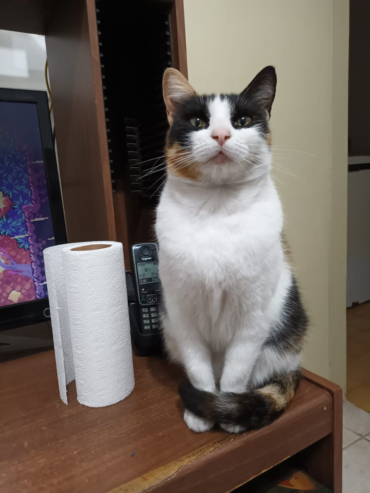
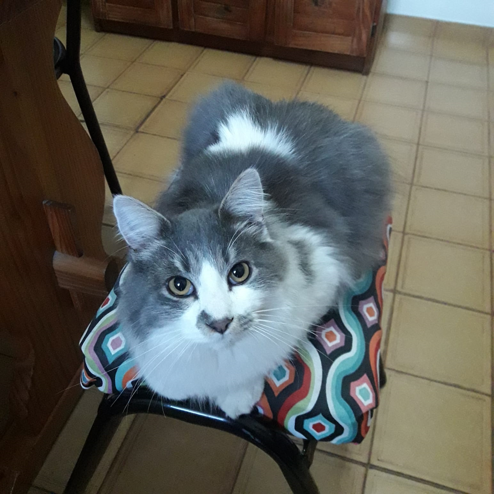

# Luciano Ardanaz Sgalla

Hola, estoy cursando mi segundo de la tecnicatura en programación universitaria, terminé la secundaria en 2022 y empecé la universidad justo después, elegí la unahur debido a la comodidad que me trae tener una universidad cerca y elegí la carrera por gusto personal sin saber casi nada de programación, ni siquiera un curso este segundo año está siendo con diferencia en el que más cosas siento que estoy aprendiendo. Como podra notar por la foto de perfil o la foto que esta justo debajo de este texto, tengo mucho aprecio por los gatos, especialmente por mis dos mascotas Fuffy y Cleo

**Cleo**

**Fuffy**

Mi pasatiempo más notorio es jugar videojuegos, más concretamente, juegos de un solo jugador de corta duración, entre mis favoritos se encuentran Katana Zero, Celeste y Nuclear Throne, este último perteneciendo a mi genero de videojuegos favoritos Rogue Likes, esto debido a que en ellos, a lo largo de múltiples intentos, se busca pasarse el juego en si, obligándote a aprender sobre el juego mediante un sistema de muerte permanente que al perder te obliga a volver a intentar desde el principio, lo que lleva a un ciclo de intentos fallidos y aprendizaje constante, hasta lograr tu objetivo.
